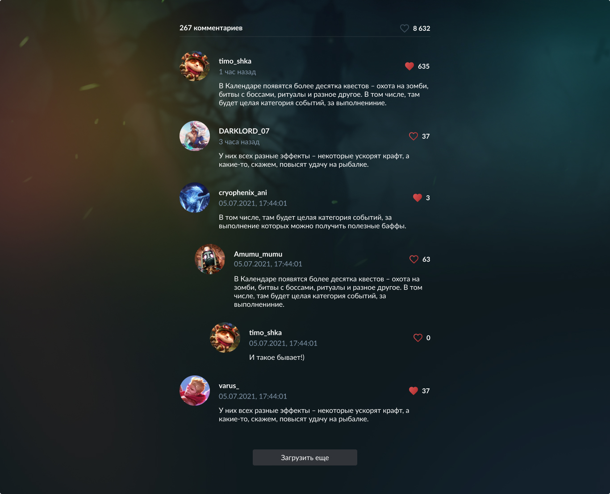

# Тестовое задание

* Репозиторий не форкать
* Предоставить ссылку на репозиторий, с деплоем выполненного задания

## Задачи:

* Вывести на экран комментарии, соблюдая их вложенность и пагинацию, используя запросы из `src/api`
* Посчитать сумму лайков и комментариев
* Добавить возможность лайкать комментарии

## Нельзя:

* Модифицировать папку `src/api`, `src/assets`, `src/data`, `src/lib`, 
* Менять содержимое возвращаемых данных в `src/data`

Что не запрещено - то разрешено

## Используемые технологии: 

* vite
* react
* tanstack/react-query
* emotion/styled
* axios
* axios-mock-adapter
* typescript
* eslint
* prettier

## Дизайн:

### Figma [Comments.fig](./figma/technical-task.fig)

